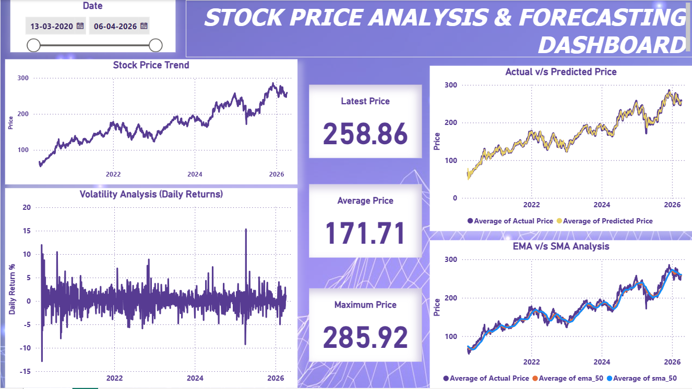
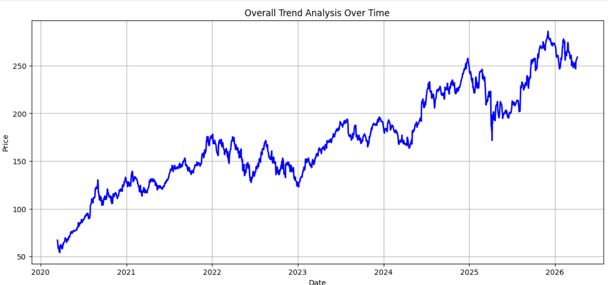
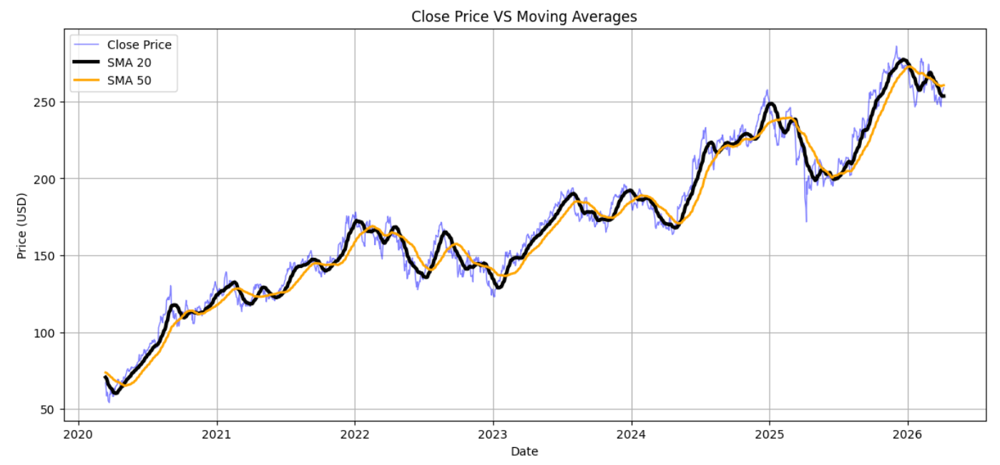
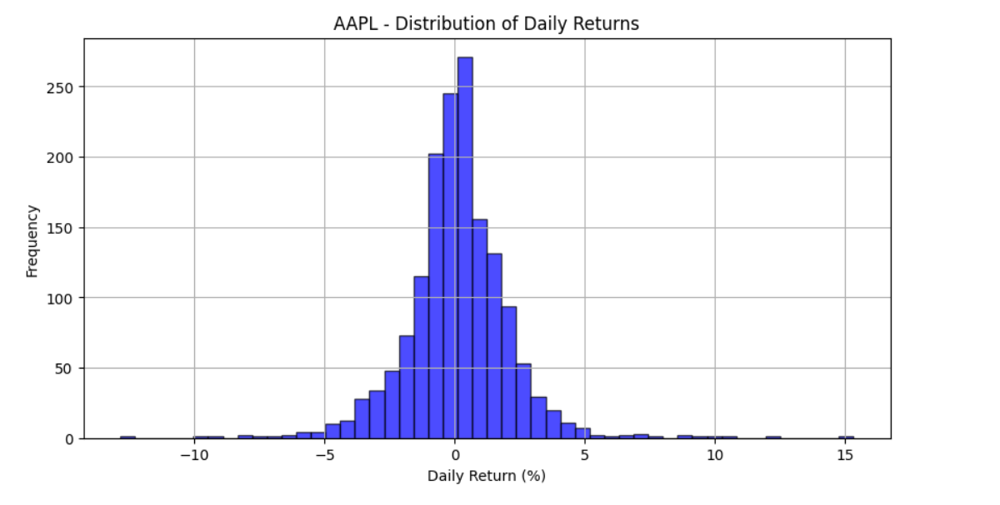
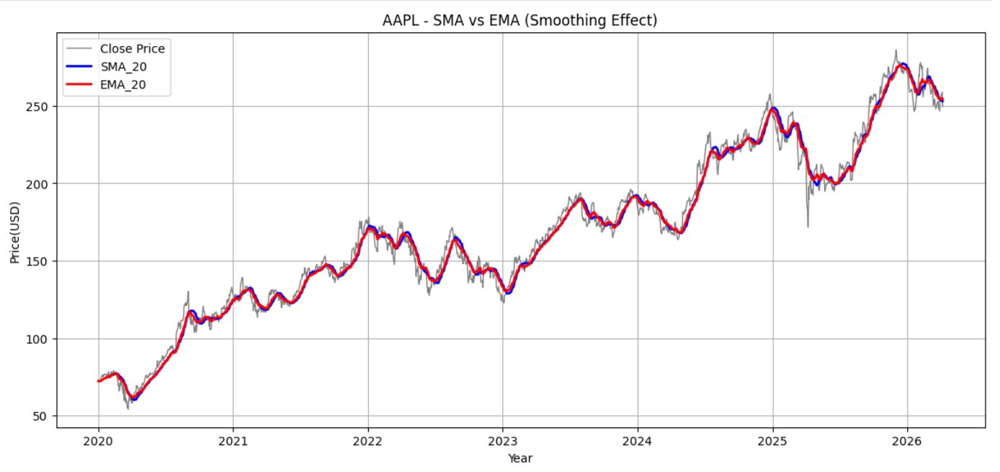
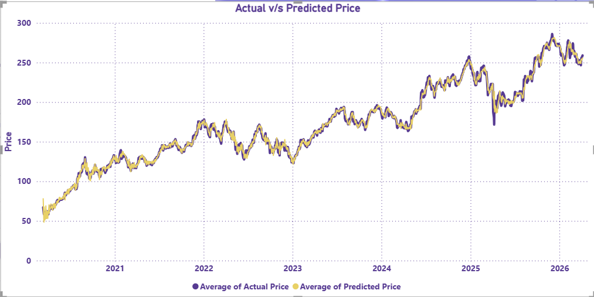

# Stock-Price-Trend-Analysis-and-Prediction

**Project Overview**

This project focuses on analyzing historical stock price data and building a predictive model to forecast next-day prices. It includes data cleaning, feature engineering, time series analysis, and an interactive Power BI dashboard.

**Tools & Technologies:**

- Python (Pandas, NumPy, Matplotlib, Scikit-learn)
- SQL (for structured analysis)
- Power BI (Dashboard visualization)

**Key Steps Performed:**

- Data Cleaning and Preprocessing
- Feature Engineering (SMA, EMA, Daily Returns)
- Time Series Analysis
- Regression Model for Prediction
- Dashboard Creation in Power BI

**Dashboard Preview:**

**Key Insights:**

**1. Overall Upward Trend**
   

 - The stock shows overall upward trend over time & has shown a remarkable growth overtime with its price moving from nearly 70 to 280 from Year 2020 - 2026

**Recommendation:** AAPL is a strong candidate for long term portfolio holding. Investors who stayed invested through dips were rewarded with nearly 4x return in 6 years. Businesses managing employee pension funds or retail investors should consider AAPL as a core holding rather than a trading stock.

**2. Sustained Bullish Momentum**

 
- Could be observed that close price is consistently staying above both simple moving averages 20 & 50 throughout indicates a sustained bullish trend suggesting that stock has maintained strong upward momentum over 6 years

**Recommendation:** Instead of guessing when to buy AAPL, fund managers can follow a simple rule — whenever the price drops close to or below the 50 day average, it is a good time to buy. History shows the price always recovered after such dips which makes us decisive based on data. 

**3. Volatility**   

- Volatility shows a concentrated daily return between -5 % and +5% slightly centered between 0 & 1% suggesting a positive bias,
  Rare extreme events beyond ±10% exist but are very infrequent, suggesting they were driven by 
  specific news or events rather than regular market behavior.  

**Recommendation:** Stock does not swing wildly in price on most days — it moves in a small, steady and mostly positive direction. This makes it a safe and reliable stock for people who cannot afford big losses — like those saving for retirement, education, or long term goals. Small daily gains may look tiny alone but over years they add up significantly.

 **4. EMA- Strong Predictor**

 
-  EMA_20 consistently hugging the Close price more tightly than SMA_20, confirming EMA's faster reaction to price 
movements indicates that it detects the trend shifts earlier.

**Recommendation:** Active traders and algorithmic trading systems should use EMA as a primary signal for entry and exit decisions. Switching from SMA to EMA based signals could help traders enter rallies earlier and exit dips faster, directly improving returns on short term AAPL trades.

**Predictive Model: Next-Day Price Prediction**

**Linear Regression model** was built to predict the next day's closing price of AAPL using engineered features.

**Features Used:**
- Prev_close,SMA_20, SMA_50, EMA_20, EMA_50

**Approach:**
- Created a `Target` column by shifting Close price by 1 day
-  Used chronological 80/20 split (no data leakage)
- Trained a Linear Regression model on historical data
- Trained a Random Forest model also but it did not perform well compared to linear regression model as my data had linear relationship: Features showed **0.98+ correlations** with Target (prev_close: 0.99, ema_20: 0.988, sma20: 0.984), So Linear Regression worked well here & was chosen.

**Linear Regression Model Results:**

| Metric | Score | Meaning |
|--------|-------|---------|
| MAE | 4.34 | Predictions are on average only $4.78 off |
| RMSE | 6.30 | No major outlier predictions |
| R2 | 0.95 | Model explains 95% of price movement |

**Recommendation:** The model achieved an excellent R2 score of 0.95 with an average error of just $4.34 on a stock trading around $180-$280 — confirming that SMA, EMA and Previous close are strong predictors of next day price. This model can assist traders in making **data driven next day price estimates** with high confidence.

  

